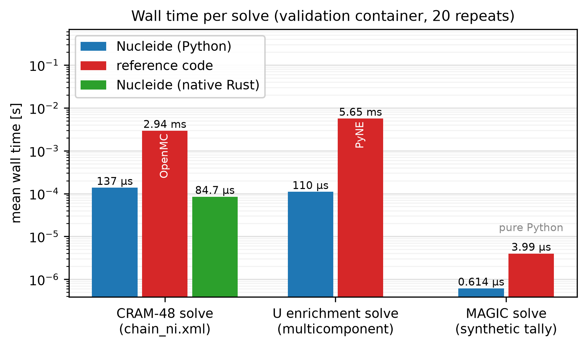

<!-- markdownlint-disable MD025 -->

# Summary

Nucleide is a toolkit for the nuclear-engineering workflow *around* particle
transport codes: reading and writing legacy code files (MCNP, Serpent, FLUKA),
canonical nuclide identification across a dozen naming dialects, embedded
nuclear reference data (AME2020 masses, IUPAC 2013 abundances, ENDF/B-VIII.0
half-lives), material construction, one-step burnup-matrix depletion with the
Chebyshev Rational Approximation Method (CRAM) [@pusa2010cram; @pusa2016cram],
multicomponent isotope enrichment cascades (MARC/SWU) [@wood1999marc], and
variance-reduction utilities (MAGIC weight windows [@cooper2001magic] and
alias-table mesh source sampling [@walker1977alias; @vose1991alias]). It also
provides activation-code interop (ALARA deck, flux, schedule, and output glue;
FISPACT-II inventory tables; ORIGEN tape readers),
deterministic-transport file glue (CCCC cross-section and flux readers with a
PARTISN deck writer), and rigorous two-step shutdown-dose-rate (R2S) workflow
orchestration.

The core is written in Rust as a composable workspace of fourteen crates. A thin
PyO3 layer exposes a typed Python API (wheels for Linux, macOS, and Windows via
PyPI), and a `wasm-bindgen` build powers interactive tutorials that run
entirely in the browser. Correctness is anchored by byte-exact golden fixtures,
a strict CI pipeline (formatting, linting, unit and Python tests, coverage,
end-to-end browser tests), and a cross-code validation harness whose results
are committed to the repository.

# Statement of need

Analysts who work with Monte Carlo transport codes spend much of their time on
the surrounding file formats and data conversions rather than on transport
itself. PyNE [@pyne2014] pioneered this "toolkit around transport codes" role,
but its C++/Cython/Fortran build chain (CMake, MOAB, generated nuclear-data
HDF5) makes installation and embedding difficult, and the project sees little
active maintenance. OpenMC [@romano2015openmc; @romano2021depletion] absorbed
some of these capabilities natively (depletion, weight windows) but does not
provide legacy-code I/O or enrichment analytics, and its transport-centric API
is not designed as an embeddable utility library.

Nucleide fills this gap with a memory-safe, dependency-light Rust core that
installs from PyPI in seconds (`pip install nucleide`), has no CMake or Fortran
toolchain, and — uniquely among comparable tools — runs in the browser through
WebAssembly, enabling zero-install interactive teaching materials. It is a
complement to PyNE and OpenMC, not a competitor: it deliberately ports their
well-validated algorithms and validates against them (see below), while
omitting transport itself.

The same file-format burden surrounds activation analysis and deterministic
transport: ALARA, FISPACT-II, and ORIGEN inputs and listings, CCCC
cross-section and flux files, and PARTISN decks are long-lived text formats
with no shared reader, so fusion shutdown-dose-rate workflows stitch them
together with ad hoc scripts [@pyne2014; @davis2011gvr]. Nucleide treats this
glue as part of the same toolkit role: read-only interop and workflow
orchestration around the physics codes, sharing nuclide identities and
mesh-source machinery with the Monte Carlo side rather than reimplementing any
solver.

# Software design

The Rust workspace enforces strict layering: capability crates (`nucleide-nuclei`,
`nucleide-material`, `nucleide-mcnp-io`, `nucleide-serpent-io`, `nucleide-fluka-io`,
`nucleide-vr-tools`, `nucleide-enrichment`, `nucleide-depletion`, `nucleide-linalg`,
`nucleide-alara-io`, `nucleide-cccc-io`, `nucleide-fispact-io`, `nucleide-origen-io`,
`nucleide-r2s`) never depend on the bindings; `bindings/python` and
`bindings/wasm` are thin facades with no business logic; the pure-Python
package re-exports the compiled module behind `.pyi` stubs so the public API is
fully typed and `mypy --strict` clean. Parsers reproduce legacy output
byte-for-byte where the reference codes have formatting quirks, guarded by
golden-byte fixtures.

Two design choices improve on the reference implementations. The depletion
crate implements CRAM in incomplete-partial-fraction product form with a sparse
LU factorization whose symbolic pattern is computed once and reused across all
poles, and it validates inputs that crash or silently corrupt results in the
reference codes (invalid half-lives, duplicate reaction entries, malformed
tallies). The enrichment solver adds a golden-section polish to the classic
sign-tracking descent for the optimal mass separation factor $M^*$
[@wood1999marc; @zeng2014cascade].

The five newer crates are read-only glue and orchestration: they parse the
text interfaces of their codes and repack them for downstream workflows, never
reimplementing transport or activation solvers. ALARA and FISPACT-II results
share one analysis shape (`ResponseFrame`), so activation summaries from
either code feed the same downstream tooling. The WebAssembly build exposes
the same glue, with interactive tutorials covering activation analysis and
deterministic I/O alongside the existing depletion, enrichment, MAGIC, and
file-parsing demos.

# Validation and performance

The repository contains a runnable cross-code validation harness
(`validation/`, results committed in `validation/results.md`) comparing
Nucleide 0.1.0 against PyNE 0.7.5 (numerically identical to the 0.7.8 release
for the exercised modules) and OpenMC 0.16.0:

- **Depletion**: CRAM-48 on a realistic nickel activation chain agrees with
  OpenMC's CRAM-48 solver to a maximum relative difference of $8.3\times10^{-15}$;
  on the full 228-nuclide CASL/VERA simplified depletion chain (fission product
  yields, decay branching, fresh-UO$_2$ inventory) the final density vectors
  agree to a maximum relative difference of $8.9\times10^{-15}$; a
  three-nuclide chain matches the closed-form Bateman solution to
  $\sim10^{-15}$.
- **Enrichment**: the $M^*$-optimizing multicomponent solver agrees with PyNE's
  `multicomponent()` to $\sim10^{-4}$ or better in stage counts, $M^*$, and
  separative work for uranium and tungsten feeds; the small residuals stem from
  the AME2020-vs-AME2016 mass tables and the golden-section polish.
- **MAGIC weight windows**: output matches the reference formula exactly on a
  shared test tally (PyNE's MOAB-dependent path was unavailable, so a
  formula-equivalent reference was used).
- **Nuclear data**: natural abundances and half-lives match OpenMC exactly
  (both derive from IUPAC 2013 [@meija2016iupac] and ENDF/B-VIII.0
  [@brown2018endf]); masses match OpenMC's AME2020 [@huang2021ame2020;
  @wang2021ame2020] tables exactly and PyNE's AME2016 tables to
  $4\times10^{-6}$ u; all name-dialect conversions match `pyne.nucname`
  exactly.
- **Performance**: single-step CRAM-48 solves run in $\sim$137 µs from Python
  ($\sim$77 µs native) versus $\sim$2.9 ms for OpenMC's Python path; the
  default uranium enrichment solve runs in $\sim$106 µs versus $\sim$5.6 ms
  for PyNE; MAGIC weight-window generation runs in $\sim$0.6 µs versus
  $\sim$3.8 µs for an equivalent pure-Python implementation.

Beyond the measured comparisons above, the harness also covers activation and
deterministic I/O through `validation/activation_vs_refs.py`, described here
as coverage rather than measured claims. The script checks the ALARA, CCCC,
FISPACT-II, ORIGEN, and R2S readers against committed fixtures for
self-consistency (row and variable counts, spot values, totals, PARTISN render
and validate round-trips, and workflow smoke tests), plus container-only PyNE
oracle probes where PyNE exposes a usable entry point, with every skip
recorded loudly in the report. Committed results regenerate through the same
container entry point as the rest of the harness (`run_container.sh`). No
numeric agreement claims are made here.

# Documentation

The documentation website (built with Astro, deployed to GitHub Pages) provides
tutorials, an API reference, and theory pages deriving the implemented
mathematics, plus eight interactive browser tutorials powered by the WebAssembly
build that let users run depletion, enrichment, MAGIC, file-parsing,
activation-analysis, and deterministic-transport examples with no installation.
Two prose tutorials cover the new glue: activation analysis (ALARA,
FISPACT-II, and ORIGEN files with an R2S workflow) and deterministic I/O
(ISOTXS and flux files with PARTISN deck writing), each paired with a matching
interactive demo.

# Availability

Nucleide is BSD-2-Clause-licensed and developed at
<https://github.com/nukehub-dev/nucleide>. Python wheels are published to PyPI;
the Rust crates can be published to crates.io from the same release workflow.

# Acknowledgements

Nucleide's algorithms are ports of work by the PyNE and OpenMC communities; the
author thanks both projects for their openly available code and documentation.

# References
