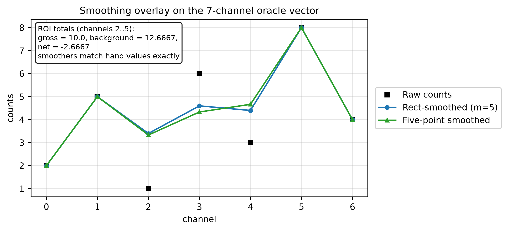

<!-- markdownlint-disable MD025 -->

# Summary

Nucleide is a toolkit for the nuclear-engineering workflow *around* particle
transport codes: reading and writing legacy code files (MCNP, Serpent, FLUKA),
canonical nuclide identification across a dozen naming dialects, embedded
nuclear reference data (AME2020 masses, IUPAC 2013 abundances, ENDF/B-VIII.0
half-lives, decay branches, and fission yields, plus ENDF/B and
NIST-derived screening cross sections, neutron
scattering lengths, and prompt decay energies), material construction,
multi-step burnup-matrix depletion with the
Chebyshev Rational Approximation Method (CRAM) [@pusa2010cram; @pusa2016cram]
(Predictor/CECM/CF4 time integrators with activity and decay-heat observables),
multicomponent isotope enrichment cascades (MARC/SWU) [@wood1999marc], and
variance-reduction utilities (MAGIC weight windows [@cooper2001magic] and
alias-table mesh source sampling [@walker1977alias; @vose1991alias]). It also
provides activation-code interop (ALARA deck, flux, schedule, and output glue;
FISPACT-II inventory tables; ORIGEN tape readers),
deterministic-transport file glue (CCCC cross-section and flux readers with a
 PARTISN deck writer), and rigorous two-step shutdown-dose-rate (R2S) workflow
 orchestration. It also provides prescribed-reactivity point kinetics for
transient analysis, gamma-measurement analytics (spectrum smoothing, counting,
calibration, and X-ray lines), single-material card emission across five code
dialects, ENDL electron-library reading, and NumPy tally bridges. It creates
tokamak fusion-neutron sources — ring, point, and parametric Miller-geometry
plasmas with ion-temperature-broadened D-D/D-T spectra, sampled to particle
vectors and emitted as MCNP `SDEF` and Serpent source cards
[@brysk1973; @ballabio1998; @fausser2012; @boschhale1992] — and scores their
first-wall impact with NRT and arc-dpa displacements plus He/H gas production
folded over caller spectra [@norgett1975; @nordlund2018]. Further analytics
cover foil-activation spectrum unfolding (SAND-II iteration [@mcelroy1967]),
clearance screening against nuclide limit tables with the sum-of-fractions rule
[@sublet2017], and 1D tritium diffusion-trapping transport through single- and
multi-layer walls. Geometry glue translates MCNP CSG to OpenMC, Serpent, PHITS,
and GDML inputs, and MCPL utilities merge, extract, profile, and repair
particle lists.

The core is written in Rust as a composable workspace of twenty-three crates. A thin
PyO3 layer exposes a typed Python API (wheels for Linux, macOS, and Windows via
PyPI), and a `wasm-bindgen` build powers interactive tutorials that run
entirely in the browser. Correctness is anchored by byte-exact golden fixtures,
a strict CI pipeline (formatting, linting, unit and Python tests, coverage,
end-to-end browser tests), and a cross-code validation harness whose results
are committed to the repository.

# Statement of need

Analysts who work with Monte Carlo transport codes spend much of their time on
the surrounding file formats and data conversions rather than on transport
itself. PyNE [@pyne2014] pioneered this "toolkit around transport codes" role,
but its C++/Cython/Fortran build chain (CMake, MOAB, generated nuclear-data
HDF5) makes installation and embedding difficult, and the project sees little
active maintenance. OpenMC [@romano2015openmc; @romano2021depletion] absorbed
some of these capabilities natively (depletion, weight windows) but does not
provide legacy-code I/O or enrichment analytics, and its transport-centric API
is not designed as an embeddable utility library.

Nucleide fills this gap with a memory-safe, dependency-light Rust core that
installs from PyPI in seconds (`pip install nucleide`), has no CMake or Fortran
toolchain, and — uniquely among comparable tools — runs in the browser through
WebAssembly, enabling zero-install interactive teaching materials. It is a
 complement to PyNE, OpenMC, and PyRK, not a competitor: it deliberately ports their
 well-validated algorithms and validates against all three (see below), while
 omitting transport itself.

The same file-format burden surrounds activation analysis and deterministic
transport: ALARA, FISPACT-II, and ORIGEN inputs and listings, CCCC
cross-section and flux files, and PARTISN decks are long-lived text formats
with no shared reader, so fusion shutdown-dose-rate workflows stitch them
together with ad hoc scripts [@pyne2014; @davis2011gvr]. Nucleide treats this
glue as part of the same toolkit role: read-only interop and workflow
orchestration around the physics codes, sharing nuclide identities and
mesh-source machinery with the Monte Carlo side rather than reimplementing any
solver.

# Software design

The Rust workspace enforces strict layering: capability crates (`nucleide-nuclei`,
`nucleide-material`, `nucleide-mcnp-io`, `nucleide-serpent-io`, `nucleide-fluka-io`,
`nucleide-vr-tools`, `nucleide-enrichment`, `nucleide-depletion`, `nucleide-linalg`,
`nucleide-alara-io`, `nucleide-cccc-io`, `nucleide-fispact-io`, `nucleide-origen-io`,
`nucleide-r2s`, `nucleide-kinetics`, `nucleide-spectroscopy`, `nucleide-emit`,
`nucleide-mcpl-io`, `nucleide-csg-xlate`, `nucleide-tritium`,
`nucleide-plasma-source`, `nucleide-damage`, `nucleide-unfold`)
 never depend on the bindings; `bindings/python` and
`bindings/wasm` are thin facades with no business logic; the pure-Python
package re-exports the compiled module behind `.pyi` stubs so the public API is
fully typed and `mypy --strict` clean. Parsers reproduce legacy output
byte-for-byte where the reference codes have formatting quirks, guarded by
golden-byte fixtures.

Two design choices improve on the reference implementations. The depletion
crate implements CRAM in incomplete-partial-fraction product form with a sparse
LU factorization whose symbolic pattern is computed once and reused across all
poles, and it validates inputs that crash or silently corrupt results in the
reference codes (invalid half-lives, duplicate reaction entries, malformed
tallies). The enrichment solver adds a golden-section polish to the classic
sign-tracking descent for the optimal mass separation factor $M^*$
[@wood1999marc; @zeng2014cascade].

The ten newer crates are read-only glue, orchestration, and closed-form
analytics: they parse the text interfaces of their codes and repack them for
downstream workflows, never reimplementing transport or activation solvers.
ALARA and FISPACT-II results share one analysis shape (`ResponseFrame`), so
activation summaries from either code feed the same downstream tooling —
including the clearance screen, which pairs parsed inventories with
caller-supplied limit tables (defaulting to a documented transcription of EU
2013/59/Euratom Annex VII Table A). The WebAssembly build exposes
the same surface, with interactive tutorials covering activation analysis,
deterministic I/O, point-kinetics transients, gamma-ray spectroscopy,
fusion sources, damage metrics, spectrum unfolding, clearance screening, and
tritium permeation alongside the existing depletion, enrichment, MAGIC, and
file-parsing demos.

# Validation and performance

The repository contains a runnable cross-code validation harness
(`validation/`, results committed in `validation/results.md`) comparing
 Nucleide against PyNE 0.7.5 (numerically identical to the 0.7.8 release
 for the exercised modules) and OpenMC 0.16.0:

- **Depletion**: CRAM-48 on a realistic nickel activation chain agrees with
  OpenMC's CRAM-48 solver to a maximum relative difference of $8.3\times10^{-15}$;
  on the full 228-nuclide CASL/VERA simplified depletion chain [@kim2015vera] (fission product
  yields, decay branching, fresh-UO$_2$ inventory) the final density vectors
  agree to a maximum relative difference of $8.9\times10^{-15}$; a
  three-nuclide chain matches the closed-form Bateman solution [@bateman1910] to
  $\sim10^{-15}$.
- **Enrichment**: the $M^*$-optimizing multicomponent solver agrees with PyNE's
  `multicomponent()` to $\sim10^{-4}$ or better in stage counts, $M^*$, and
  separative work for uranium and tungsten feeds; the small residuals stem from
  the AME2020-vs-AME2016 mass tables and the golden-section polish.
- **MAGIC weight windows**: output matches the reference formula exactly on a
  shared test tally (PyNE's MOAB-dependent path was unavailable, so a
  formula-equivalent reference was used).
- **Point kinetics**: prescribed-reactivity transients match analytic gates —
  the 1-group step response matches the closed-form two-exponential to a worst
  relative error of $8.1\times10^{-8}$ over 7 nodes, the prompt-jump factor is
  exact, and the 6-group stable period matches the inhour root to
  $4.0\times10^{-14}$; a ramp transient cross-checked against the upstream
  PyRK neutronics block [@huff2015pyrk] agrees to $1.6\times10^{-4}$ at three
  probes.
- **Spectroscopy**: rectangular ($m=5$) and five-point smoothing, background,
  and gross/net counting on the 7-channel oracle vector match hand values
  exactly and agree with `pyne.spectanalysis`/`pyne.gammaspec` [@pyne2014] to
  $\sim10^{-16}$; X-ray line intensities match hand values to
  $1.9\times10^{-16}$.
- **Fusion sources**: ring/point geometry checks are exact, Ballabio spectrum
  moments match an independent Table III transcription to $<10^{-12}$, the
  Miller map matches the upstream `openmc-plasma-source` implementation
  exactly, reactivities match NeSST to $5.8\times10^{-9}$, and end-to-end
  parametric birth moments match fine quadrature to $<10^{-2}$.
- **Damage metrics**: SPECTER-report-transcribed spots (Fe/Ti/Cu dpa, C/Li/B/N
  He/H appm, Fe He/dpa) fold within the $10^{-4}$ print precision; analytic
  NRT/arc gates match closed forms to $<10^{-15}$.
- **Spectrum unfolding**: synthetic forward-fold round-trips recover spectra
  to $\sim10^{-16}$ (determined) and reproduce rates to $10^{-9}$ with the
  guess error halved (6-detector/24-group underdetermined case); IRDFF-II
  analytical benchmark shapes recover to $\sim10^{-16}$.
- **Clearance screening**: the inventory overlap with the Apache-2.0 `pypact`
  reader agrees exactly (7 nuclide-steps, $0.0$ difference); hand-computed
  clearance-index vectors match exactly and the $=1$ boundary classifies both
  sides correctly.
- **Nuclear data**: natural abundances and half-lives match OpenMC exactly
(both derive from IUPAC 2013 [@meija2016iupac] and ENDF/B-VIII.0
  [@brown2018endf]); masses match OpenMC's AME2020 [@huang2021ame2020;
  @wang2021ame2020] tables exactly and PyNE's AME2016 tables to
  $7.1\times10^{-4}$ u max ($1.6\times10^{-5}$ u mean; the table now also
  carries per-isomer excitation masses alongside the AME2020 grounds); all name-dialect conversions match `pyne.nucname`
  exactly. Screening scattering lengths follow Sears [@sears1992], and prompt
  decay energies plus 14-MeV totals follow ENDF/B-VII.1 [@chadwick2011endf71].
  Fission yields (independent and cumulative sets for the 36 neutron-induced
  and spontaneous parents, carried from the ENDF/B-VII.1 evaluations) match
  the ENDF/B-VIII.0 tape values exactly at the probe rows, with per-energy
  independent-yield sums within $1.2\times10^{-7}$ of 2
  [@brown2018endf; @chadwick2011endf71]; the same library backs the depletion
  chain fallback when a chain omits yields for a fissionable parent.
- **Performance**: single-step CRAM-48 solves run in $\sim$134 µs from Python
  ($\sim$85 µs native) versus $\sim$3.0 ms for OpenMC's Python path; the
  default uranium enrichment solve runs in $\sim$110 µs versus $\sim$5.8 ms
  for PyNE; MAGIC weight-window generation runs in $\sim$0.6 µs versus
  $\sim$4.0 µs for an equivalent pure-Python implementation.

Beyond the measured comparisons above, the harness also covers activation and
deterministic I/O through `validation/activation_vs_refs.py`, described here
as coverage rather than measured claims. The script checks the ALARA, CCCC,
FISPACT-II, ORIGEN, and R2S readers against committed fixtures for
self-consistency (row and variable counts, spot values, totals, PARTISN render
and validate round-trips, and workflow smoke tests, including the ARMI
snapshot adapter [@touran2017armi]), plus container-only PyNE
oracle probes where PyNE exposes a usable entry point, with every skip
recorded loudly in the report. Screening dose factors follow HNF-SD-WM-TI-707
Rev.1 / HNF-5636 App. O via PyNE dbgen [@hnf1999dose; @hnf2001dose], and
emission-drift plus ARMI-key checks run as self-consistency coverage.
MCPL merge/extract/stats utilities, GDML schema validation, and OpenMC/Serpent
weight-window emission likewise run as golden-text and re-parse/load probes.
Committed results regenerate through the same
container entry point as the rest of the harness (`run_container.sh`). No
numeric agreement claims are made here.

# Documentation

The documentation website (built with Astro, deployed to GitHub Pages) provides
tutorials, an API reference, and theory pages deriving the implemented
mathematics, plus twenty-two interactive browser tutorials powered by the WebAssembly
 build that let users run depletion, enrichment, MAGIC, file-parsing,
 activation-analysis, deterministic-transport, point-kinetics, and
 gamma-spectroscopy examples with no installation.
Two prose tutorials cover the new glue: activation analysis (ALARA,
FISPACT-II, and ORIGEN files with an R2S workflow) and deterministic I/O
(ISOTXS and flux files with PARTISN deck writing), each paired with a matching
interactive demo.

# Availability

Nucleide is BSD-2-Clause-licensed and developed at
<https://github.com/nukehub-dev/nucleide>. Python wheels are published to PyPI;
the Rust crates can be published to crates.io from the same release workflow.

# Acknowledgements

Nucleide's algorithms are ports of work by the PyNE, OpenMC, and PyRK communities; the
 author thanks all three projects for their openly available code and documentation.

# References
